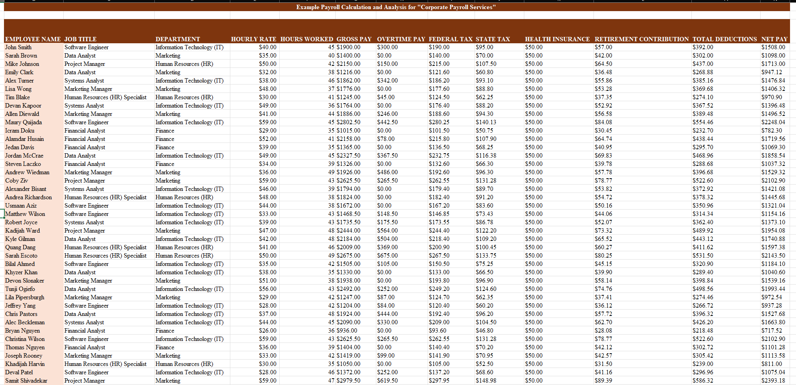
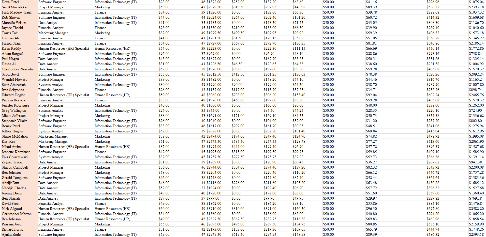
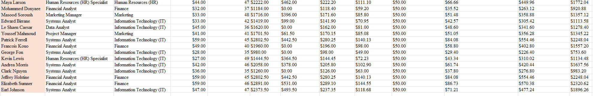
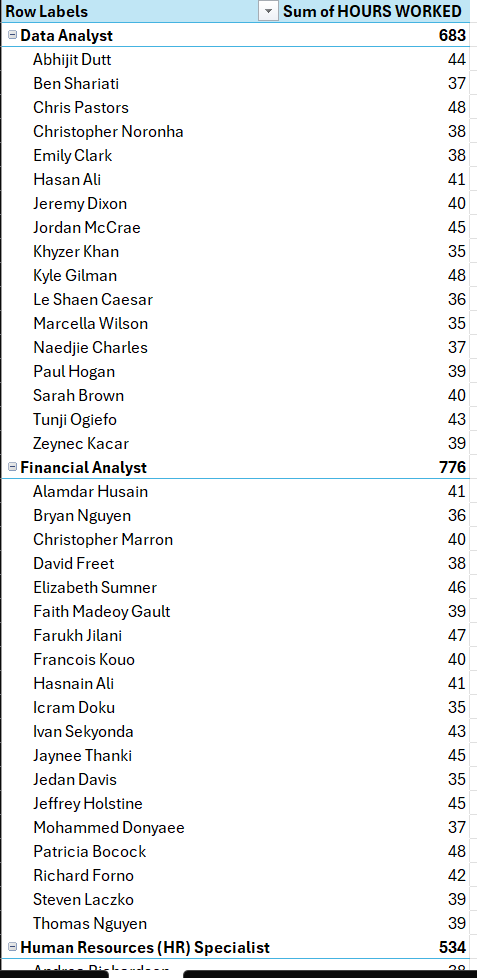
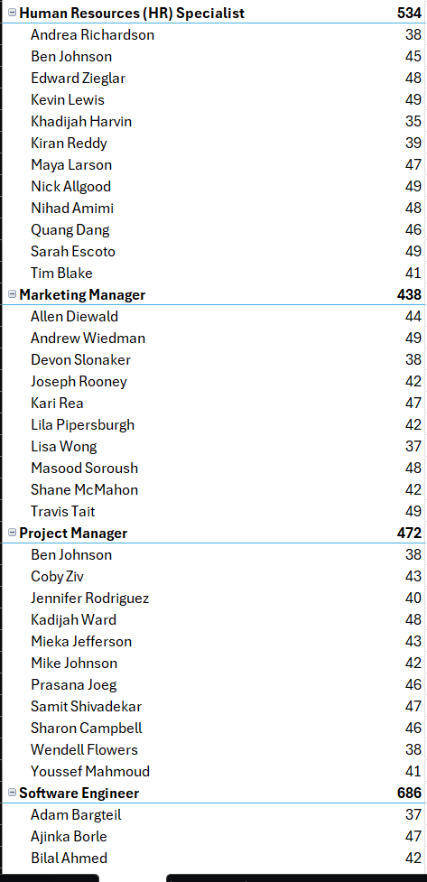
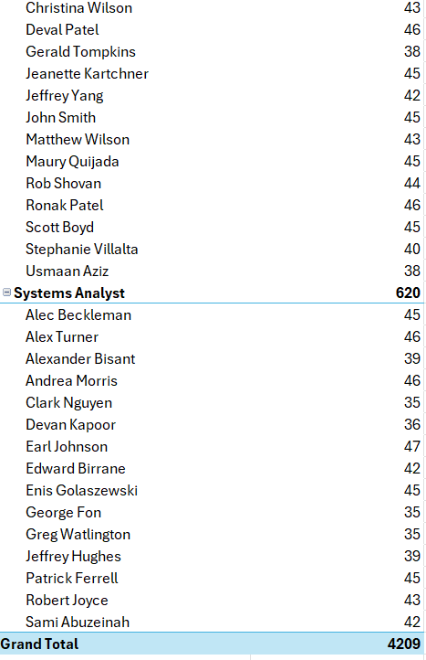

# README to Know More About the Example Payroll Calculation for Corporate Payroll Services:

## Description:

In this project, I created a Payroll Spreadsheet that automates and analyzes employee payment data using Microsoft Excel formulas of addition, subtraction, and multiplication. I used 
addition for Gross Pay, Multiplication for Gross Pay, Subtraction/Multiplication for Overtime Pay, Multiplication for Federal Tax, Multiplication for Retirement Contradiction, addition
for Total Deductions and subtraction for Net Pay.

## Skills Applied in This Project:

1. Microsoft Excel (Used Microsot Excel Formulas)
2. Data Entry
3. Pivot Tables

## Screenshots for `Example_Payroll_Calculation_Analysis_For_Corporate_Payroll_Services.xlsx` Microsoft Excel Spreadsheet Files with Pivot Tables:

